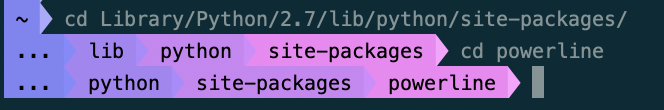

# Cascading Rainbow-- A custom Powerline segment

### built by Mel Sawyer

[Powerline](https://powerline.readthedocs.io/en/master/) is a plugin to produce statusline segments. This is a custom segment to display the **current working directory** in a satisfying gradient of rainbow colors. All of the existing functionality of the `cwd` segment still remains (shortening directory names, adding a max depth, etc)-- this customization merely adds gradient coloring on top. I built this segment for use in a bash prompt, but it should theoretically work in vim, zsh, tmux, etc. 

## Examples

## Installation & configuration

