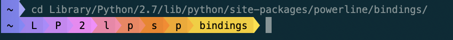
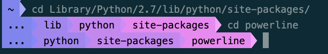
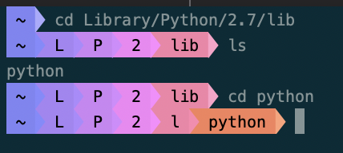
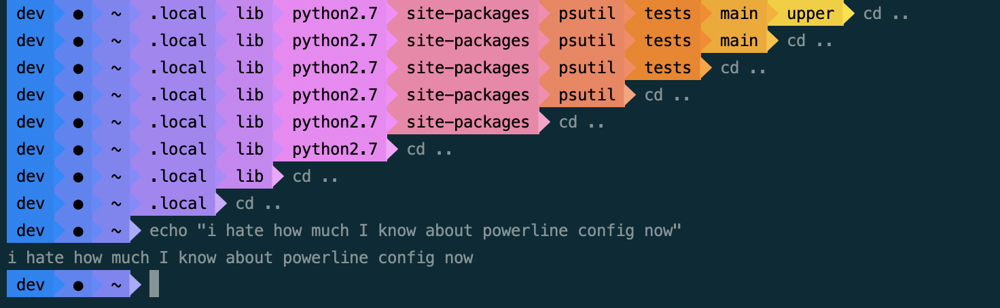

# Cascading Rainbow-- A custom Powerline segment


### built by Mel Sawyer

[Powerline](https://powerline.readthedocs.io/en/master/) is a plugin to produce statusline segments. This is a custom segment to display the **current working directory** in a satisfying gradient of rainbow colors. All of the existing functionality of the `cwd` segment still remains (shortening directory names, adding a max depth, etc)-- this customization merely adds gradient coloring on top. I built this segment for use in a bash prompt, but it can also be modified to work in vim, zsh, tmux, etc. 

## Examples
  
Here's an example with `dir_shorten_length`=1. All directories above the current directory are shortened to a length of 1, making the prompt slightly more wieldy.

  
This example uses `dir_limit_depth`=3, meaning that the prompt only displays 3 directories and an ellipse. 

  
Another example with `dir_shorten_length`=1, showing how the current directory is fully expanded and then collapses into 1 character as the user moves down the file tree. 

. 
This one just looks pretty and is simultaneously horribly impractical. 

## Installation

Install powerline: 
```
pip install powerline-status
```
(or other installation options detailed [here](https://powerline.readthedocs.io/en/master/installation.html))


### Using pip:
```
pip install cascading-rainbow
```

## Configuration

**In order to configure powerline to use the cascading_rainbow segment, you'll need to do the following:**

Go into your powerline config directory. You might find it easier to move the config files to another directory.
```
cp -r ~/Library/Python/3.8/lib/python/site-packages/powerline/config_files/* ~/.config/powerline  #replace with location of powerline installation on your machine
```
Within `config_files`, you should see roughly the following directory structure:

|-- colors.json  
|-- config.json  
|-- colorschemes  
|------ default.json   
|-- themes  
|------- shell  
|-----------default.json  


(You'll probably have more subdirectories than this).  

#### Add the rainbow gradient to your colors.json file.
This is where you're telling powerline which colors you want to use in the output. Below are the colors I used with a couple variations. Note that output colors might look different depending on your terminal settings. Feel free to use whatever colors here you'd like! 

Add the following gradient definition **at the bottom of your colors.json file** 
``` 
"rainbow": [
                        [105, 141, 177, 213, 211, 209, 208, 214, 220, 214, 208, 209, 211, 213, 177, 141, 105, 69, 33, 69]
                ]
```
  
#### Set the color gradient to use for the `cascading_rainbow` segment
Next, add the following to your colorschemes/[colorscheme].json file. (I usually copy `default.json` into a new file, in this case `rainbow.json`, in order to keep everything separate). 
```
"cascading_rainbow":          { "fg": "black", "bg": "rainbow", "attrs": [] }
```
(if you'd like to make your text white, or bold, or use a different gradient besides `rainbow`, you can do so here.)

The `blue_red` gradient that comes in the powerline installation is also nice to use with this segment:

#### Declare the segment in your `theme` file
Within the `themes` directory are a bunch of JSON files for different themes. I created a new theme within the `shell` directory (since this extension is running within bash). This is what my theme, `rainbow.json`, contains. 

```
"segments": {
                "left": [
                        {
                                "function": "powerline.segments.shell.mode"
                        },
                        {
                                "function": "powerline.segments.common.net.hostname",
                                "priority": 10
                        },
                        {
                                "function": "cascading_rainbow.rainbow.rainbow_segment",
                                "args" : {
                                        "dir_shorten_len" : 4,
                                        "dir_limit_depth" : 5
                                },
                                "priority": 10
                        }
                ]
        }
}
```

The [Powerline documentation](https://powerline.readthedocs.io/en/master/) contains a lot more information about configuring the built-in segments, what arguments to pass, etc. The main thing to note is that the `cascading_rainbow` segment simply extends the `cwd` segment, so it has all the capabilities of cwd. Here, I'm passing the `dir_shorten_len` and `dir_limit_depth` parameters in order to make the prompt less horrendous looking. 

#### Add the `cascading_rainbow` segment to your theme
In `config.json`, you'll see a list of what themes & colorschemes are being used. Since this is running on bash, powerline will use the theme & colorscheme listed under `shell`. Make sure you define whatever theme & colorscheme you created. Since my colorscheme was `rainbow.json` and my theme was `shell/rainbow.json`, my `config.json` looks like this:

```
...
"shell": {
			"colorscheme": "rainbow",
			"theme": "rainbow",
		},
 ...
``` 

You may need to restart the powerline-daemon (`powerline-daemon --replace`) or even kill it (`powerline-daemon --kill`) and open a new terminal pane to see your changes take effect. 

#### Usage with vim, tmux, etc.
I haven't attempted to use the rainbow segment in any context besides bash, so no guarantees that it'll work. That being said, it should theoretically function the same :) Currently working on a vim-friendly version so stay tuned .

# License 
Licensed under the MIT License.
